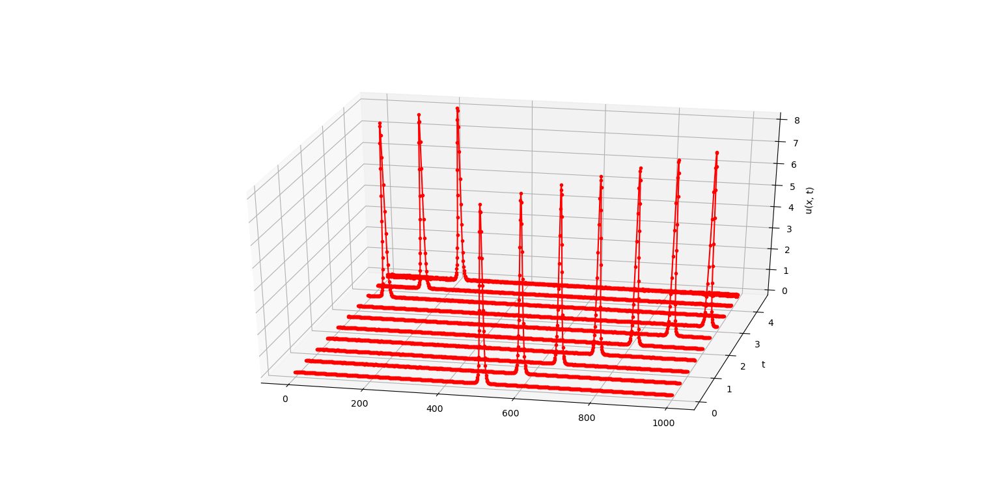

# Параллельное и распределенное программирование

## OpenMP

методичка А.С. Антонова
[Параллельное программирование
с использованием технологии
OpenMP ](https://parallel.ru/sites/default/files/info/parallel/openmp/OpenMP.pdf)

* example1 - подсчет интеграла
* example2 - решение дифференциального уравнения методом Рунге-Кутты
* example3 - решение системы ОДУ методом Рунге-Кутты
* example4 - решение уравнения [Кортевега-де Фриза](https://ru.wikipedia.org/wiki/Уравнение_Кортевега_—_де_Фриза) методом [Рунге-Кутты](https://ru.wikipedia.org/wiki/Метод_Рунге_—_Кутты)

    

    

## MPI

* example5 - разные приммеры, в том числе из лекций
* example6 - решение уравнения [Кортевега-де Фриза](https://ru.wikipedia.org/wiki/Уравнение_Кортевега_—_де_Фриза) методом [Рунге-Кутты](https://ru.wikipedia.org/wiki/Метод_Рунге_—_Кутты)

Решение 

    // Параметры времени start_time=0, end_time=5.0 step_time=h=0.0001 
    // Параметры начальной формулы k=2 x0=50
    > mpiexec -n 2 Debug\main.exe 0. 5.0 0.0001 2 50 

    

